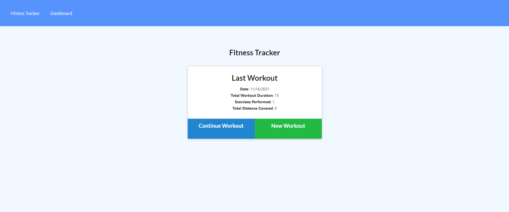
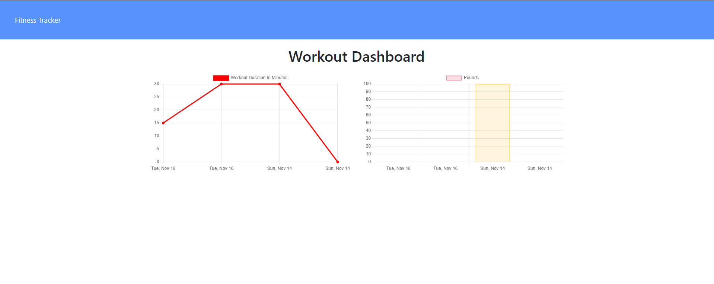

# Fitness-Tracker
  

  ## Description:
A fitness app that allows the user to view, create, and track daily workouts. The user is able to log multiple exercises in a given day and also go back and update the workout.

## Deployed Application:
 
 https://fitness-tracker101.herokuapp.com/

  ## Table of Contents 
  
  * [Installation](#installation)
  
  * [Screenshot](#screenshot)
  
 * [License](#license)
  
  * [Questions](#questions)
  
  ## Installation:
  To install all dependencies, run the following:

  `
  npm install
  `
  ## Screenshot:

  
  

  ## License:
  

    This repository is licensed under the MIT license 

  ## Questions:
  Questions about this repository? Please contact me at [mohamed.lazrekb@gmail.com](mailto:mohamed.lazrekb@gmail.com). View more of my work in GitHub at [Lazrekm](https://github.com/lazrekm) 